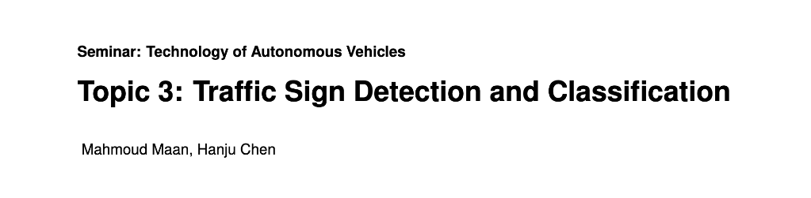

# 🚦 Traffic Sign Detection and Classification

A comprehensive deep learning project that combines both detection and classification of traffic signs, utilizing state-of-the-art computer vision techniques and neural network architectures.

> 📝 Originally presented at the Technology of Autonomous Vehicles Students Seminar  
> Topic 3: Traffic Sign Detection and Classification  
> Authors: Mahmoud Maan, Hanju Chen

### 📑 [Read Our Full Research Paper Here](https://github.com/mahmoud-maan/Traffic-Signs-Detection-and-Classification/blob/main/Paper-Traffic_Sign_Detection_and_Classification.pdf)



## 🎯 Project Overview

This project addresses the challenge of traffic sign recognition through a two-stage approach, as presented in our seminar on autonomous vehicle technology and detailed in our [research paper](https://github.com/mahmoud-maan/Traffic-Signs-Detection-and-Classification/blob/main/Paper-Traffic_Sign_Detection_and_Classification.pdf):
1. **Classification**: Using a Convolutional Neural Network (CNN) to classify between 43 different traffic signs
2. **Detection**: Implementing YOLOv4 for accurate traffic sign detection in images and videos

### ✨ Key Features

- Combined detection and classification pipeline for 43 different traffic sign classes
- High-accuracy CNN classifier built with TensorFlow
- YOLOv4-based detection system trained on Darknet framework
- Integration using OpenCV for real-world applications
- Support for both image and video processing

## 📊 Datasets

The project utilizes two prominent datasets:
- **GTSRB** (German Traffic Sign Recognition Benchmark) for classification
- **GTSDB** (German Traffic Sign Detection Benchmark) for detection

## 🏗️ Model Architecture & Performance

### 🧠 Classification Model
- **Architecture**: Custom CNN implemented using TensorFlow
- **Key Components**:
  - Convolutional Neural Network layers
  - Dropout regularization
  - Batch Normalization
- **Performance**:
  - Test Accuracy: 97.41%
  - Enhanced performance through regularization techniques

### 👁️ Detection Model
- **Architecture**: YOLOv4
- **Framework**: Darknet
- **Performance**:
  - Mean Average Precision (mAP): 64.7%

## 📂 Project Structure

```
├── CNN_to_YOLO(detection from 4 classes to 43 classes).ipynb
├── Data_to_YOLO_format_4Classes.ipynb
├── Traffic_Signs_Classification.ipynb
├── YOLOv4_Training.ipynb
├── detection_results/
└── test_images/
```

## 💻 Implementation Details

1. **Traffic Sign Classification**:
   - Implemented in `Traffic_Signs_Classification.ipynb`
   - CNN-based approach for 43-class classification
   - Includes data preprocessing and model training

2. **Traffic Sign Detection**:
   - Main implementation in `YOLOv4_Training.ipynb`
   - YOLOv4 configuration and training
   - Detection pipeline setup

3. **Integration**:
   - Combined detection and classification pipeline
   - OpenCV integration for real-world applications
   - Support for both image and video processing

## 📈 Results

The project achieved significant results in both tasks:
- Classification accuracy of 97.41% on the test set
- Detection mAP of 64.7%
- Successful integration of both models for comprehensive traffic sign recognition

## 📚 Repository Contents

- `CNN_to_YOLO(detection from 4 classes to 43 classes).ipynb`: Notebook for converting CNN model to YOLO format
- `Data_to_YOLO_format_4Classes.ipynb`: Data preparation and formatting
- `Traffic_Signs_Classification.ipynb`: Classification model implementation
- `YOLOv4_Training.ipynb`: Detection model training and setup
- `detection_results/`: Directory containing detection results
- `test_images/`: Sample images for testing

## ⚙️ Requirements

- Python 3.x
- TensorFlow
- OpenCV
- Darknet framework
- Additional dependencies as specified in the notebooks
